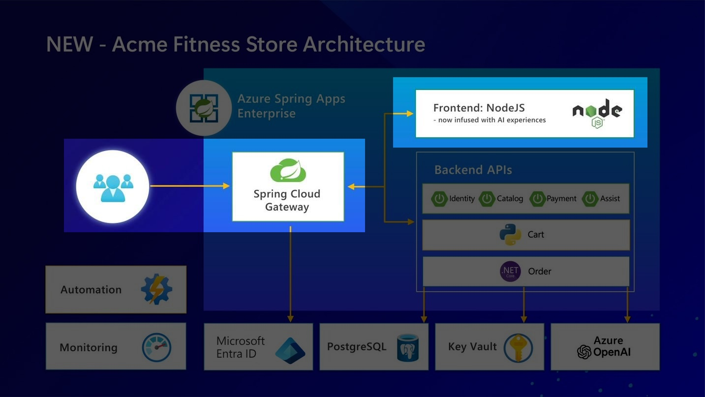
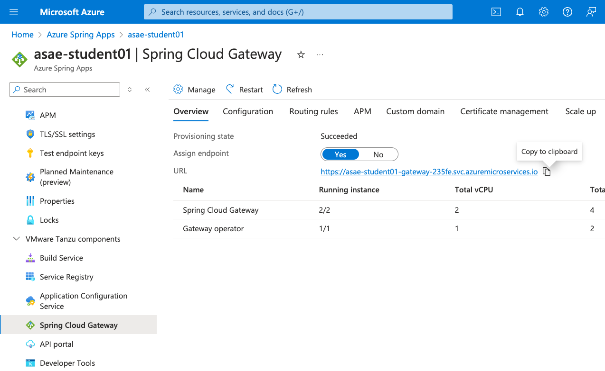
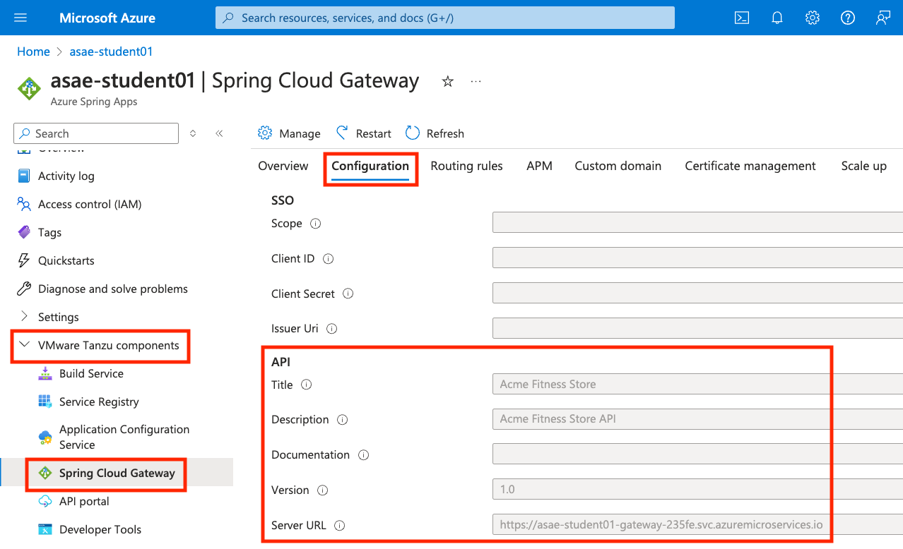
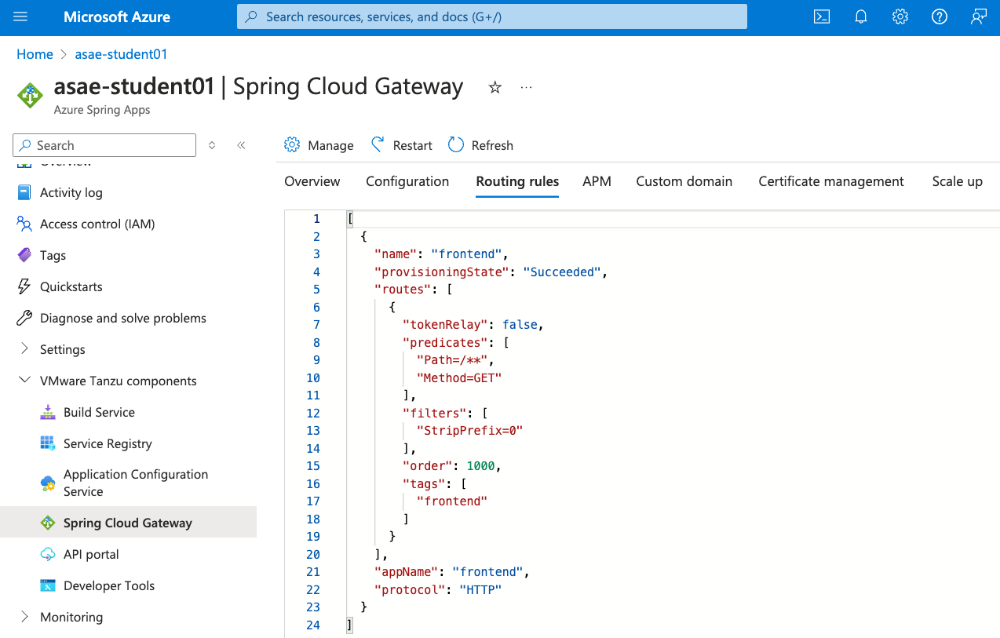

# 05 - Deploy Frontend Application

In this previous lab we deployed a simple Spring Boot application. In this lab, we look at the polyglot microservice e-commerce application `acme-fitness-store`.

The diagram below shows the architecture of the polyglot e-commerce application:


In this lab, we will focus only on the frontend component and configure the Spring Cloud Gateway - making sure the requests are properly routed to the frontend component:




## Create and deploy frontend application

* Make sure you are in the `labs/acme-fitness-store` folder, e.g.

```shell
pwd
```

```text
/home/neven/labs/acme-fitness-store
```

* If your shell window has been restarted, make sure you executed the setup environment script we created in the previous labs. e.g.

```shell
source azure-spring-apps-enterprise/scripts/setup-env-variables.sh
```

```text
SUBSCRIPTION=asae-student01
RESOURCE_GROUP=asae-student01
SPRING_APPS_SERVICE=asae-student01
REGION=westeurope
CUSTOM_BUILDER=no-bindings-builder
```

* Create a placeholder for the frontend application, e.g.

```shell
az spring app create --name ${FRONTEND_APP} --instance-count 1 --memory 1Gi
```

* Once the app has been created, deploy the frontend application, e.g.

```shell
az spring app deploy --name ${FRONTEND_APP} --source-path apps/acme-shopping
```

* You can check the list of applications with:

```shell
az spring app list -o table
```

## Configure Spring Cloud Gateway

* Assign a public endpoint and update the Spring Cloud Gateway configuration with API information, e.g.

```shell
az spring gateway update --assign-endpoint true
export GATEWAY_URL=$(az spring gateway show --query properties.url --output tsv)
```

* You can also get this URL from the Azure Portal, e.g.



* Let's update the Spring Cloud Gateway API description, e.g.

```shell
az spring gateway update \
    --api-description "Acme Fitness Store API" \
    --api-title "Acme Fitness Store" \
    --api-version "1.0" \
    --server-url "https://${GATEWAY_URL}" \
    --allowed-origins "*" \
    --no-wait
```

* You can observe the [output](output-az-spring-gateway-update.txt).

* Also, you can observe these changes in Azure Portal, e.g.



* Let's configure the routing rules next, e.g.

```shell
az spring gateway route-config create \
    --name ${FRONTEND_APP} \
    --app-name ${FRONTEND_APP} \
    --routes-file azure-spring-apps-enterprise/resources/json/routes/frontend.json
```

* Also, you can observe these changes in Azure portal, e.g.



* Test the gateway URL and see that it points to the frontend application, e.g.


> Note that other microservices are not deployed yet, like catalog service that returns the products in the shop. So you won't see any products showing up in the e-commerce store just yet.

* Congratulations! You have successfully configured the Spring Cloud Gateway and frontend application.

## Next Guide

Next guide - [06 - Deploy Backend Applications](../06-deploy-backend-applications/README.md)
