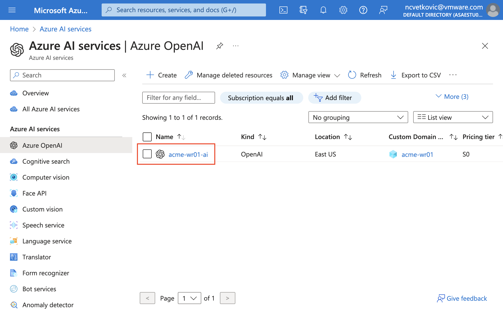
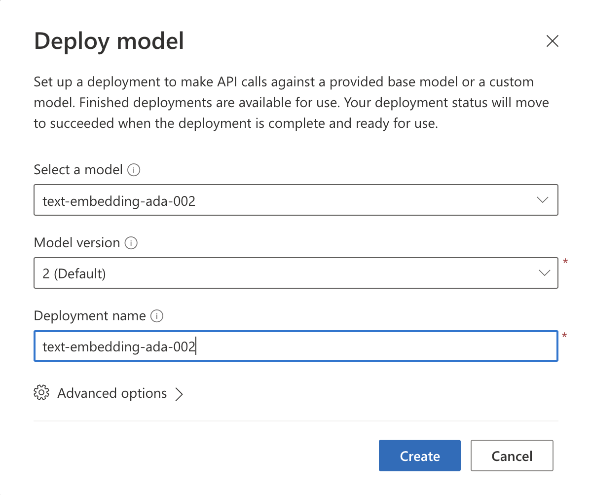

# Azure OpenAI の準備

ワークショップのインストラクターに事前に Azure OpenAI に関する設定がされているか確認してください。
利用する Azure サブスクリプションで Azure OpenAI のリソースにアクセスが許可されている必要があります。

1. `OPENAI_RESOURCE_NAME` に対してグローバルに一意の名前を設定します。

1. 下記のコマンドを実行し、リソースグループに Azure OpenAI リソースを作成します。

   ```bash
   source ./azure-spring-apps-enterprise/scripts/setup-ai-env-variables.sh
   export OPENAI_RESOURCE_NAME=<choose-a-resource-name>
   az cognitiveservices account create \
      -n ${OPENAI_RESOURCE_NAME} \
      -g ${RESOURCE_GROUP} \
      -l eastus \
      --kind OpenAI \
      --sku s0 \
      --custom-domain ${OPENAI_RESOURCE_NAME}   
   ```
   
   Azure Portal で `Azure AI Services`　の下にリソースが作成されている事を確認してください。

   

1. Azure OpenAI サービスに `text-embedding-ada-002` と `gpt-35-turbo-16k` のモデルをデプロイします。
   
   ```bash
   az cognitiveservices account deployment create \
      -g ${RESOURCE_GROUP} \
      -n ${OPENAI_RESOURCE_NAME} \
      --deployment-name text-embedding-ada-002 \
      --model-name text-embedding-ada-002 \
      --model-version "2"  \
      --model-format OpenAI \
      --scale-type "Standard" 

    az cognitiveservices account deployment create \
      -g ${RESOURCE_GROUP} \
      -n ${OPENAI_RESOURCE_NAME} \
      --deployment-name gpt-35-turbo-16k \
      --model-name gpt-35-turbo-16k \
      --model-version "0613"  \
      --model-format OpenAI \
      --scale-type "Standard"
   ```

   > ご注意: 最新バージョンの `gpt-35-turbo-16k` のモデルは、Azure CLI で実行できない可能性があります。

   上記の作業は `Azure AI Studio` で行うこともできます。Open AI サービスの `Deployments` に移動し、`Manage Deployments`ボタンをクリックすることで `Azure AI Studio` に移動できます。

   

   もしくは、直接リンクにアクセスすることもできます。例えば、https://oai.azure.com/

   

   

   

1. `azure-spring-apps-enterprise/scripts/setup-ai-env-variables.sh` の値を修正してください。

    * Azure Portal の OpenAIインスタンスの `Keys and Endpoint`セクションから、エンドポイントと API キーを確認します
        
    * `AZURE_OPENAI_CHATDEPLOYMENTID` は、自身で定義したモデル名を指定します。例えば、`gpt-35-turbo-16k`
    * `AZURE_OPENAI_EMBEDDINGDEPLOYMENTID` は、自身で定義したモデル名を指定します。例えば、`text-embedding-ada-002`
    * `AI_APP` は、デフォルトの名前を指定します。例えば、`assist-service`
        
    また、Azure CLI で `cognitiveservices` のコマンドに対してクエリを行うことで、エンドポイントと API キーを取得することもできます。

   ```bash
   az cognitiveservices account show \
     --name ${OPENAI_RESOURCE_NAME} \
     --resource-group ${RESOURCE_GROUP} \
     --query 'properties.endpoint' --output tsv

   az cognitiveservices account keys list \
     --name ${OPENAI_RESOURCE_NAME} \
     --resource-group ${RESOURCE_GROUP} \
     --query 'key1' --output tsv 
   ```

> 次の作業: [03 - ベクトル・ストアでデータ処理](../03-process-data-into-vector-store/README.md)