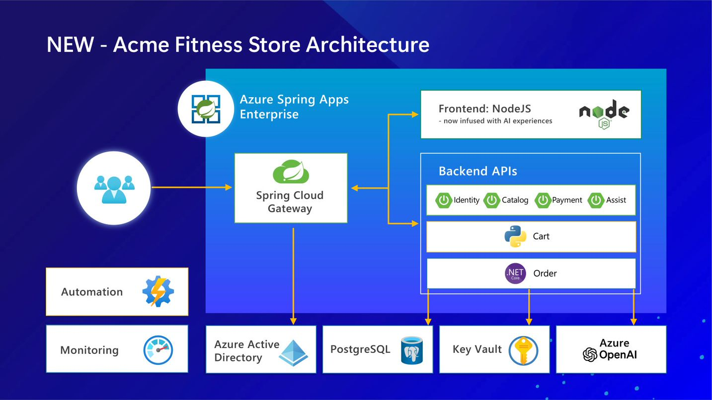

# ACME Fitness Store

ACME Fitness Store は、架空のスポーツ用品を販売するオンライン・ショップです。このリポジトリで、ACME Fitness Store アプリケーションのソース・コードとデプロイ用スクリプトを提供しています。

## ハイ・レベルのアーキテクチャ

このアプリケーションは、下記の複数のサービスから構成されています。

* Java Spring Boot アプリケーション:
  * カタログサービス：利用可能な製品を取得
  * 支払いサービス：ユーザーの注文に対する支払い処理と承認
  * ID サービス：認証されたユーザーを参照
  * 支援サービス：フィットネス・ストアに AI を適用

* Python アプリケーション:
  * カートサービス：購入用に選択されたユーザーのアイテムを管理

* ASP .NET Core アプリケーション:
  * 注文サービス：ユーザーのカートに入っている商品の購入処理

* Node.js & 静的 HTML
  * フロントエンド：フロントエンド・ショッピング・アプリケーション

このサンプルは、Azure Spring Apps Enterprise または Tanzu Application Platform にデプロイできます。

## レポジトリの構成

| ディレクトリ                                                        | 目的 |
| ---------------------------------------------------------------- | ------------- |
| [apps/](./apps)                                                   | 各サービスのソースコード  |
| [azure-spring-apps-enterprise/](./azure-spring-apps-enterprise)   | Azure Spring Apps Enterprise にデプロイするためのドキュメントとスクリプト |
| [tanzu-application-platform/](./tanzu-application-platform)       | Tanzuアプリケーションプラットフォームにデプロイするためのドキュメントとスクリプト |

## Azure Spring Apps Enterprise (ASA-E) へのアプリのデプロイ

Azure Spring Apps Enterprise を使用すると、Azure 上で Spring Boot や 多言語のアプリケーションを動作させることができます。
azure-spring-apps-enterprise/README-jp.md のクイックスタート ガイドでは、ACME Fitness ストア・アプリケーションを Azure Spring Apps Enterprise にデプロイする方法について記載しています。

* [Azure Spring Apps へのアプリケーションのデプロイ](./azure-spring-apps-enterprise/README-jp.md#deploy-spring-boot-apps-to-azure)
  * [本ワークショップで得られる内容](./azure-spring-apps-enterprise/README-jp.md#what-will-you-experience)
  * [事前準備](./azure-spring-apps-enterprise/README-jp.md#what-you-will-need)
  * [Azure CLI extension のインストール](./azure-spring-apps-enterprise/README-jp.md#install-the-azure-cli-extension)
  * [レポジトリを Clone](./azure-spring-apps-enterprise/README-jp.md#clone-the-repo)
  * [作業 0 - インストール環境の準備](./azure-spring-apps-enterprise/README-jp.md#unit-0---prepare-environment)  
  * [作業 1 - アプリケーションのビルドとデプロイ](./azure-spring-apps-enterprise/README-jp.md#unit-1---deploy-and-build-applications)
  * [作業 2 - シングル サインオンの構成](./azure-spring-apps-enterprise/README-jp.md#unit-2---configure-single-sign-on)
  * [作業 3 - Azure Database for PostgreSQL および Azure Cache for Redis の統合](./azure-spring-apps-enterprise/README-jp.md#unit-3---integrate-with-azure-database-for-postgresql-and-azure-cache-for-redis)
  * [作業 4 - アプリケーション内の機密情報の安全な読み込み](./azure-spring-apps-enterprise/README-jp.md#unit-4---securely-load-application-secrets)
  * [作業 5 - エンドツーエンドのアプリケーション監視](./azure-spring-apps-enterprise/README-jp.md#unit-5---monitor-end-to-end)
  * [作業 6 - リクエスト数に対するレート制限の設定](./azure-spring-apps-enterprise/README-jp.md#unit-6---set-request-rate-limits)
  * [作業 7 - アイデアから生産までの自動化](./azure-spring-apps-enterprise/README-jp.md#unit-7---automate-from-idea-to-production)
  * [作業 8 - フィットネス・ストアに AI を適用](./azure-spring-apps-enterprise/README-jp.md#unit-8---infuse-ai-into-fitness-store)

## Tanzuアプリケーションプラットフォーム(TAP)へのアプリのデプロイ

Tanzuアプリケーションプラットフォーム(TAP) を使用すると、多言語アプリを CNCF に準拠する Kubernetes クラスター上に、簡単に構築して実行できます。
[tanzu-application-platform/README-jp.md](./tanzu-application-platform/README-jp.md) の記載内容に従い、アプリケーションを TAP にデプロイします。
