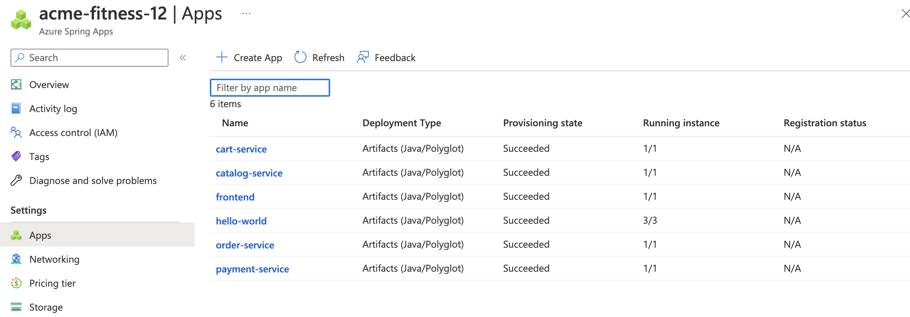

ここでは、acme-fitness アプリケーションのバックエンド・アプリをデプロイします。また、Spring Cloud Gatewayでバックエンド、アプリに対するルーティング・ルールも更新します。

以下の図は、本作業が完了した際に表示される結果を示しています


下記は、バックエンド・サービス/アプリを作成しデプロイするための手順です
- [1. バックエンド・アプリの作成](#1-create-backend-apps)
- [2. バックエンド・アプリのデプロイ](#2-deploy-backend-apps)
- [3. バックエンド・アプリに対するルーティング・ルールの作成](#3-create--routing-rules-for-the-backend-apps)


## 1. バックエンド・アプリの作成

まず最初に、各サービス毎にアプリケーションを作成すします：

```shell
az spring app create --name ${CART_SERVICE_APP} --instance-count 1 --memory 1Gi &
az spring app create --name ${ORDER_SERVICE_APP} --instance-count 1 --memory 1Gi &
az spring app create --name ${PAYMENT_SERVICE_APP} --instance-count 1 --memory 1Gi &
az spring app create --name ${CATALOG_SERVICE_APP} --instance-count 1 --memory 1Gi 
```

上記の作業が正常に成功した場合、ASA-E インスタンス内に全アプリの一覧が表示されます。



## 2. バックエンド・アプリのデプロイ

必要な全アプリを作成したので、次にアプリに対してサービスをデプロイします。デプロイには、サービスのソースコードへのアクセスが必要です。

> 💡 ソースコードを元に Build Pack でソースコードをビルドしコンテナを作成しデプロイします。そのため、ソースコードへのアクセスが必要です。

```shell
cd /workspaces/acme-fitness-store
# Deploy Payment Service
az spring app deploy --name ${PAYMENT_SERVICE_APP} \
    --config-file-pattern payment/default \
    --source-path ./apps/acme-payment \
    --build-env BP_JVM_VERSION=17

# Deploy Catalog Service
az spring app deploy --name ${CATALOG_SERVICE_APP} \
    --config-file-pattern catalog/default \
    --source-path ./apps/acme-catalog \
    --build-env BP_JVM_VERSION=17

# Deploy Order Service
az spring app deploy --name ${ORDER_SERVICE_APP} \
    --source-path ./apps/acme-order 

# Deploy Cart Service 
az spring app deploy --name ${CART_SERVICE_APP} \
    --env "CART_PORT=8080" \
    --source-path ./apps/acme-cart 
```

上記の実行で、既存の Azure Spring Apps のインスタンスに対してアプリを作成し、デプロイが完了しました。

## 3. バックエンド・アプリに対するルーティング・ルールの作成

Routing rules bind endpoints in the request to the backend applications. For example in the Cart route below, the routing rule indicates any requests to /cart/** endpoint gets routed to backend Cart App.

ルーティング・ルールは、バックエンドのアプリケーションに対するリクエストを、バックエンド用のエンドポイントにバインドします。例えば、下記の　Cart route　用のルーティングルールでは `/cart/**` に対する任意のリクエストはバックエンドの `Cart App` にルーティングすることを示しています。

```shell
cd ./azure-spring-apps-enterprise/resources/json/
pwd 
/workspaces/acme-fitness-store/azure-spring-apps-enterprise/resources/json

az spring gateway route-config create \
    --name ${CART_SERVICE_APP} \
    --app-name ${CART_SERVICE_APP} \
    --routes-file ./routes/cart-service.json
    
az spring gateway route-config create \
    --name ${ORDER_SERVICE_APP} \
    --app-name ${ORDER_SERVICE_APP} \
    --routes-file ./routes/order-service.json

az spring gateway route-config create \
    --name ${CATALOG_SERVICE_APP} \
    --app-name ${CATALOG_SERVICE_APP} \
    --routes-file ./routes/catalog-service.json
```

上記により、すべてのバックエンド・アプリの作成とデプロイが完了し、全アプリの Spring Cloud Gateway におけるルーティング・ルールの更新が完了しました。

⬅️ 前の作業: [08 - ハンズオン・ラボ 2 フロントエンド・アプリのデプロイ](../08-hol-2-deploy-frontend-app/README.md)

➡️ 次の作業: [10 - ハンズオン・ラボ 3.2 - Azure Config Service と Service Registry にアプリをバインド](../10-hol-3.2-bind-apps-to-acs-service-reg/README.md)