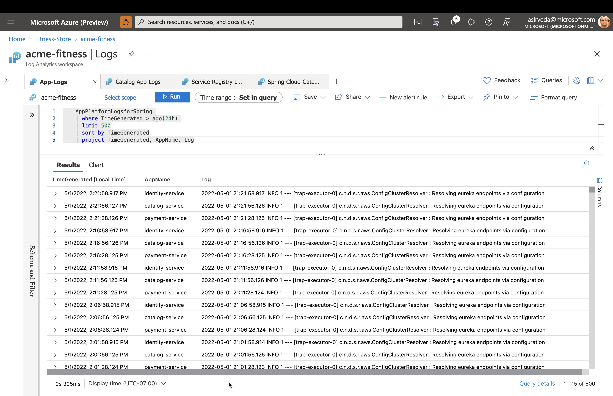
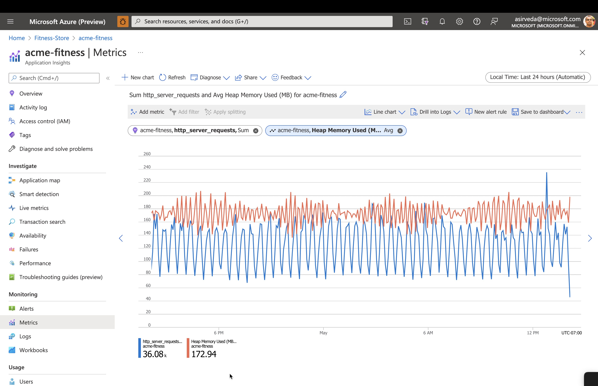
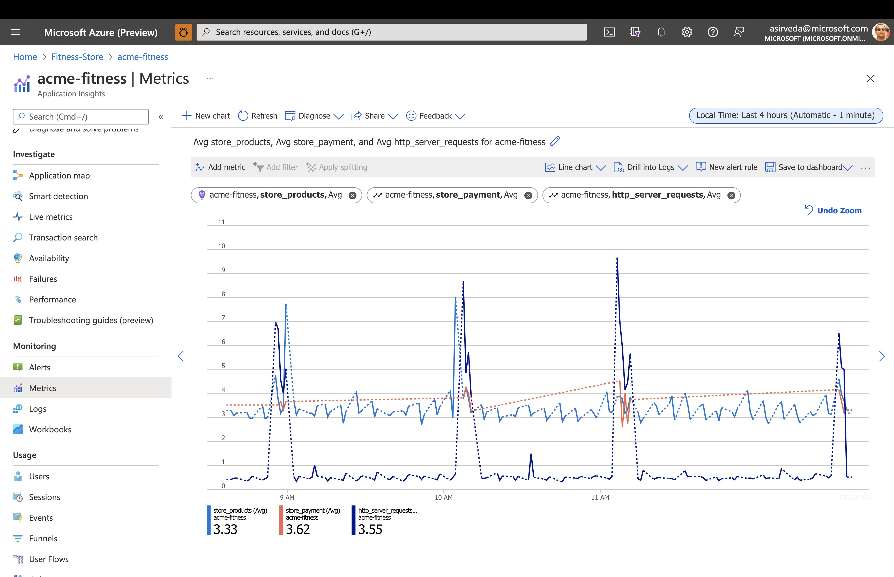

This is an optional exercise for the students. 

Open the Log Analytics that you created - you can find the Log Analytics in the same
Resource Group where you created an Azure Spring Apps service instance.

In the Log Analytics page, selects `Logs` blade and run any of the sample queries supplied below
for Azure Spring Apps.

Type and run the following Kusto query to see application logs:

```sql
    AppPlatformLogsforSpring 
    | where TimeGenerated > ago(24h) 
    | limit 500
    | sort by TimeGenerated
    | project TimeGenerated, AppName, Log
```



Type and run the following Kusto query to see `catalog-service` application logs:

```sql
    AppPlatformLogsforSpring 
    | where AppName has "catalog-service"
    | limit 500
    | sort by TimeGenerated
    | project TimeGenerated, AppName, Log
```


Type and run the following Kusto query to see errors and exceptions thrown by each app:
```sql
    AppPlatformLogsforSpring 
    | where Log contains "error" or Log contains "exception"
    | extend FullAppName = strcat(ServiceName, "/", AppName)
    | summarize count_per_app = count() by FullAppName, ServiceName, AppName, _ResourceId
    | sort by count_per_app desc 
    | render piechart
```


Type and run the following Kusto query to see all in the inbound calls into Azure Spring Apps:

```sql
    AppPlatformIngressLogs
    | project TimeGenerated, RemoteAddr, Host, Request, Status, BodyBytesSent, RequestTime, ReqId, RequestHeaders
    | sort by TimeGenerated
```

Type and run the following Kusto query to see all the logs from Spring Cloud Gateway managed by Azure Spring Apps:

```sql
    AppPlatformSystemLogs
    | where LogType contains "SpringCloudGateway"
    | project TimeGenerated,Log
```


Type and run the following Kusto query to see all the logs from Spring Cloud Service Registry managed by Azure Spring Apps:

```sql
    AppPlatformSystemLogs
    | where LogType contains "ServiceRegistry"
    | project TimeGenerated, Log
```


### Start monitoring apps and dependencies - in Application Insights

Open the Application Insights created by Azure Spring Apps and start monitoring Spring Boot applications. 
You can find the Application Insights in the same Resource Group where you created an Azure Spring Apps service instance.

Navigate to the `Application Map` blade:


Navigate to the `Performance` blade:


Navigate to the `Performance/Dependenices` blade - you can see the performance number for dependencies,
particularly SQL calls:


Navigate to the `Performance/Roles` blade - you can see the performance metrics for individual instances or roles:


Click on a SQL call to see the end-to-end transaction in context:


Navigate to the `Failures` blade and the `Exceptions` panel - you can see a collection of exceptions:


Navigate to the `Metrics` blade - you can see metrics contributed by Spring Boot apps,
Spring Cloud modules, and dependencies.
The chart below shows `http_server_requests` and `Heap Memory Used`.



Spring Boot registers a lot number of core metrics: JVM, CPU, Tomcat, Logback...
The Spring Boot auto-configuration enables the instrumentation of requests handled by Spring MVC.
The REST controllers `ProductController`, and `PaymentController` have been instrumented by the `@Timed` Micrometer annotation at class level.

* `acme-catalog` application has the following custom metrics enabled:
  * @Timed: `store.products`
* `acem-payment` application has the following custom metrics enabled:
  * @Timed: `store.payment`

You can see these custom metrics in the `Metrics` blade:



Navigate to the `Live Metrics` blade - you can see live metrics on screen with low latencies < 1 second:


⬅️ Previous guide: [04 - Hands On Lab 3 - Deploy backend apps](../04-hol-3-deploy-backend-apps/README.md)

➡️ Workshop Start: [01 - Workshop Environment Setup](../01-workshop-environment-setup/README.md)